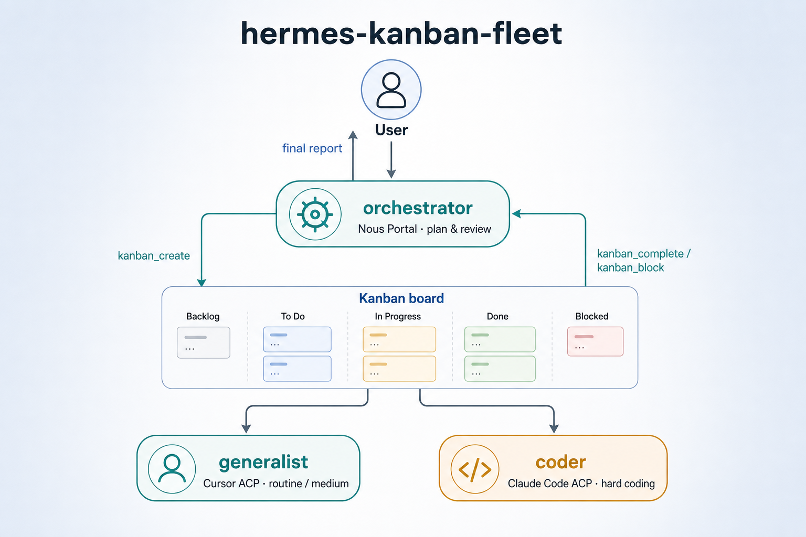

# Fleet workflow



## Roles

```text
User
  |
  v
orchestrator --kanban_create--> generalist  (Cursor ACP)
                 |                 |
                 +---------------> coder     (Claude Code ACP)
                                   |
              kanban_complete / kanban_block
                                   |
                                   v
User (final report)
```

No relay / bridge profile. Children are assigned **directly** to worker profiles.

## Routing heuristic

Assign to **`coder`** when the task is clearly hard engineering:

- multi-file refactors / greenfield modules
- tricky production bugs
- deep codebase analysis
- infrastructure that needs careful verification

Assign to **`generalist`** otherwise (research writeups, light edits, ops, docs, small fixes).

## Kanban shape

```text
parent  assignee=orchestrator   status tracks the whole user request
  |- child  assignee=generalist|coder
  |- child  …
```

Task bodies should include goals, acceptance criteria, constraints, and absolute workspace paths (`dir:C:\...` or `scratch`). Do **not** use a `delegate:` header — the assignee field is the route.

When all children are `done`, the parent becomes ready again so orchestrator can review and `kanban_complete`.

## Worker lifecycle

Dispatcher sets `HERMES_KANBAN_TASK` and spawns `hermes -p <assignee>`.

1. `kanban_show()`
2. Work in `$HERMES_KANBAN_WORKSPACE` / task `workspace_path`
3. `kanban_heartbeat` on long runs
4. `kanban_complete(summary=..., metadata=...)` or `kanban_block(reason=...)`

Workers have `kanban` in their profile `toolsets` so lifecycle tools are available. They set `kanban.dispatch_in_gateway: false` so only the orchestrator gateway dispatches.

## Orchestrator rules

- **No coding.** Do not patch/write source or run build/debug terminals for implementation. Always spawn a worker child.
- Plan, operate Kanban, review handoffs, report to the human.

## Gateway

Kanban dispatch runs inside the orchestrator gateway (`kanban.dispatch_in_gateway: true`).

```bash
hermes -p orchestrator gateway start
```

Workers do not need a running gateway for Kanban execution; the dispatcher spawns CLI worker processes.
